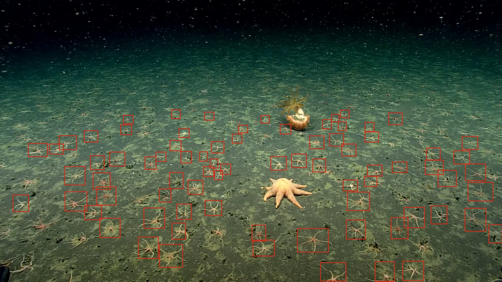
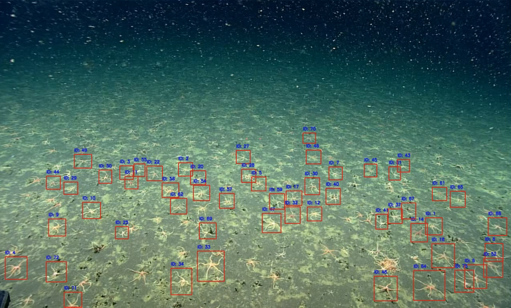

# YOLOv8 Object Tracker

<p align="center">
  
</p>

 This project is for MATE NOAA competation by CrocoMarine Rov.

 This project implements an object tracking system using the YOLOv8 model for detecting and tracking objects in real-time from video sources. The system can operate in two modes: active tracking of recognized objects or passive detection of objects in the frame.

## Table of Contents

- [Features](#features)
- [Requirements](#requirements)
- [Installation](#installation)
- [Usage](#usage)
- [Configuration Options](#configuration-options)
- [Command-Line Interface](#command-line-interface)
- [Contributing](#contributing)
- [License](#license)

## Features

- **Deep Learning Model**: Utilizes the YOLOv8 model for accurate object detection and tracking.
- **Flexible Modes**: Support for object tracking (mode = 0) and object detection (mode = 1).
- **Bounding Box Visualization**: Draws bounding boxes around detected objects with track IDs.
- **Excel Data Logging**: Saves tracking information to Excel for further analysis.
- **Video Output**: Option to save the processed video output.
- **Real-time Performance**: Capable of processing video streams in real-time.

## Requirements

Before you start, ensure you have the following installed:

    - Python 3.9+
    - OpenCV
    - Ultralytics (YOLOv8)
    - Pandas (for Excel handling)
    - Numpy

## Usage

To run the object tracker, you can either modify the main section of the code or use command-line arguments. Below is an example of how to run the tracker programmatically:

```python
from CrocoMarine_program_2024 import ObjectTracker

# Example usage
tracker = ObjectTracker(
  model_path='CrocoMarine_model_2023.pt',
  confidence_threshold=0.4,
  classes=[0],
  save_output=True,
  save_data=True,
  original_size=False,
  mode=0 # detection mode
)
input_source = "seafloor_footage.mp4" # Specify the input video file
tracker.run(input_source)
```

### Command-Line Interface

You can also run the Object Tracker script with command-line arguments.

To run the script from the command line, you would use either the following command:

```bash
python main.py -m "CrocoMarine_model_2023.pt" -ip "seafloor_footage.mp4" --mode 1 --conf 0.4 -sho -svo -svd -os
```

```bash
python main.py --model_path "CrocoMarine_model_2023.pt" --input_path "seafloor_footage.mp4" --mode 1 --conf 0.4 --classes 0 --save_output --save_data --origional_size --show_output

```

## Configuration Options

The ObjectTracker class accepts the following parameters:

    - model_path (str): Path to the YOLOv8 model file.
    - confidence_threshold (float): Confidence threshold for bounding boxes (default: 0.25).
    - classes (list): List of class indices to detect (default: [0]).
    - save_output (bool): Whether to save the output video (default: False).
    - save_data (bool): Whether to save tracking data in an Excel file (default: False).
    - original_size (bool): Whether to maintain the original size of the input video (default: False).
    - mode (int): Switches between object tracker mode (0) and detection mode (1) (default: 0).
    - show_output (bool): Whether to display the output window (default: True).

## Contributing

Contributions are welcome! If you'd like to contribute, please fork the repository and create a pull request.

## Program Output
you can switch between tracker mode and detector mode using the flag mode.

both modes will save the output video and the tracking data in an excel file.
the main difference is the ids of the tracked objects.

here is an output example:
### Detection Output
<p align="center">
  
</p>

### Tracker Output
<p align="center">
  
</p>

## License

This project is licensed under the license/royalty free copy for use and evaluation by NOAA.